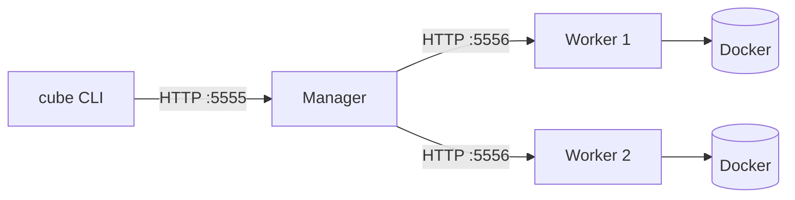
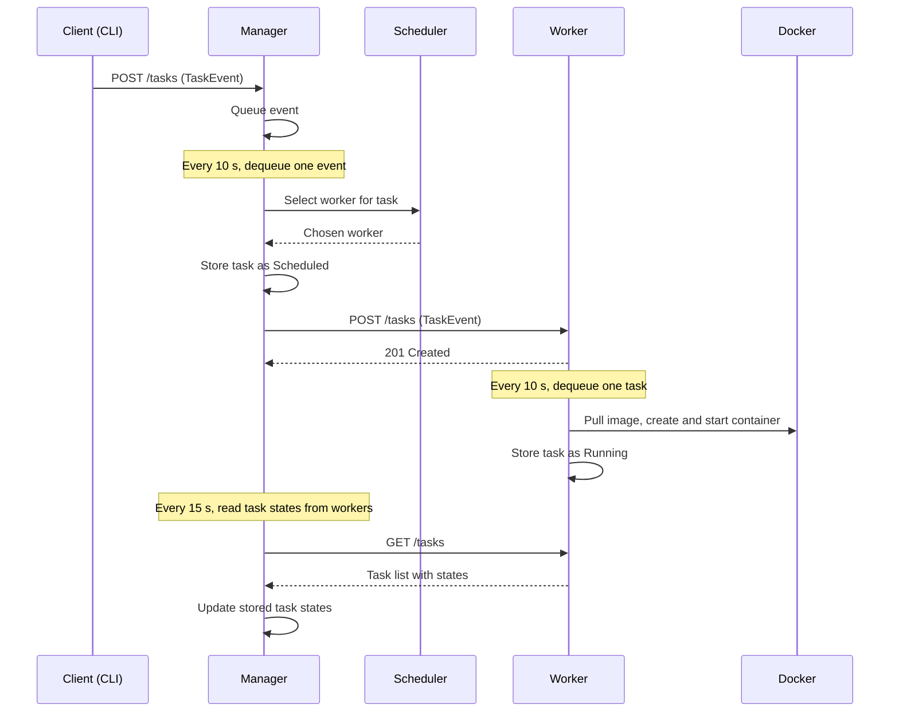
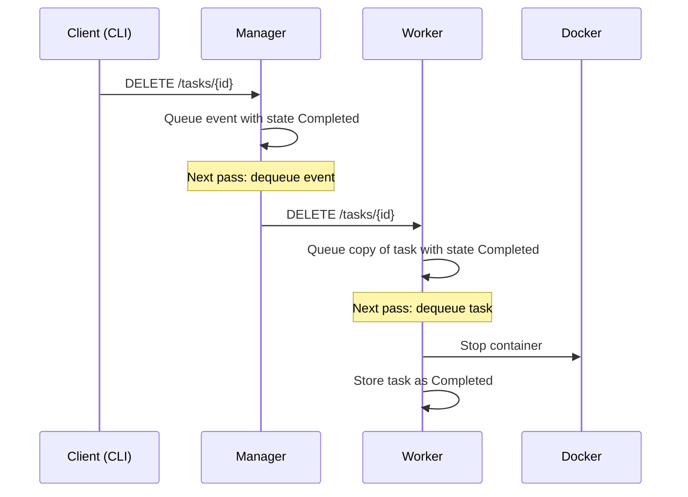
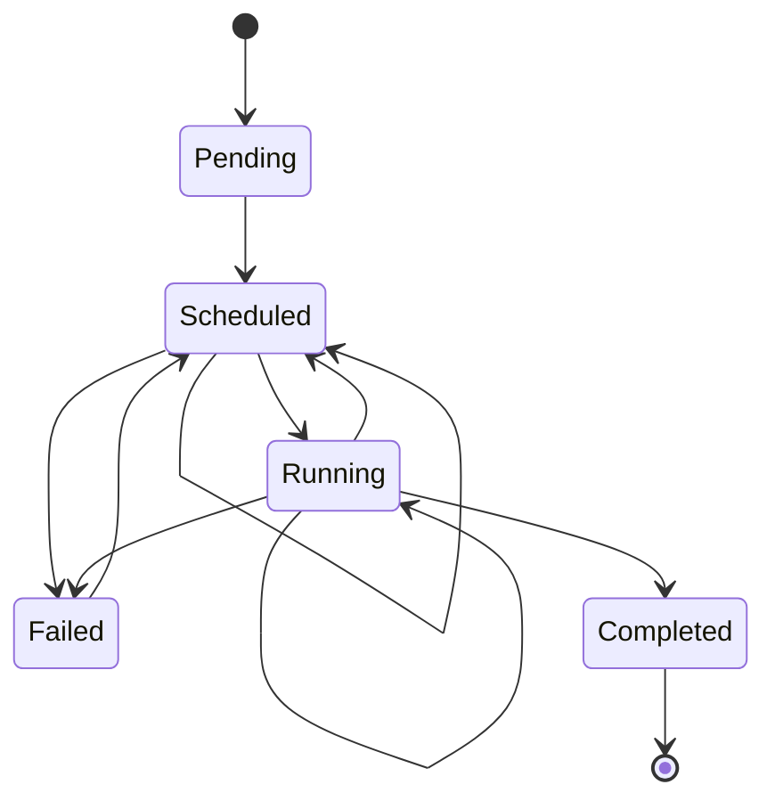

# Architecture

Cube is an orchestrator that runs tasks as Docker containers across a set of worker machines. A single manager accepts tasks from clients, chooses a worker for each one, and tracks their state.

## Components

| Package | Role |
| ------- | ---- |
| `cmd/` | The `cube` CLI. Subcommands start a manager (`manager`), a worker (`worker`), or query the cluster (`node`, `status`, `run`, `stop`). |
| `manager/` | Accepts task events over HTTP, queues them, schedules tasks on workers, collects task updates, and runs health checks. |
| `worker/` | Accepts tasks over HTTP, queues them, runs the containers through Docker, and reports task state and host statistics. |
| `scheduler/` | Chooses a worker for a task, based on the task's resource needs and each worker's free capacity. |
| `node/` | The manager's view of a worker: name, API address, capacity, allocated resources, and task count. |
| `task/` | The `Task` and `TaskEvent` types, the task state machine, and the Docker client code that starts, stops, and inspects containers. |
| `store/` | The datastore interface, with an in-memory implementation and a persistent one. Tasks and task events are stored in it. |
| `stats/` | Reads host statistics (memory, disk, CPU, load) for the worker and for node reporting. |
| `utils/` | Shared helpers, such as HTTP retry. |

## Deployment

- One manager. Each worker is listed by address when the manager starts (`--workers`).
- The CLI talks only to the manager. Workers can also be queried directly for their own tasks and stats.
- Each worker runs its containers on its own Docker daemon.

## Task flow

A task goes through the manager's queue and then the worker's queue. Each queue is drained on a timer, so changes take effect with a short delay.

If the manager can't reach the chosen worker, it puts the task back on its queue and tries again on a later pass.

### Stopping a task

The manager returns `204` once the request is queued, not once the container has stopped.

## Task lifecycle

Each task has one of five states. Transitions are checked against a table in `task/state.go`. A transition that is not in the table is rejected.

- **Pending:** the task is created but has not yet been placed on a worker.
- **Scheduled:** the manager has chosen a worker and sent the task to it.
- **Running:** the worker has started the container.
- **Completed:** the container was stopped on request.
- **Failed:** the container could not start or stopped unexpectedly.

The manager restarts a running or failed task up to 3 times, through its health checks. Each restart moves the task back to `Scheduled`. The health check runs every 60 seconds.

## Datastores

The manager keeps two stores, one for tasks and one for task events. A worker keeps one, for its tasks. Each store can be:

- **Memory** (default): fast and simple, and all data is lost on restart.
- **Persistent**: data survives restarts. Chosen with `--dbtype` on the manager and worker commands.

## Known gaps

- A worker's `DELETE /tasks/{id}` for an unknown task panics instead of returning `404`. See [issue #19](https://github.com/marasonic/cube/issues/19).
- Task states are polled, so a change on a worker can take up to 15 seconds to appear in the manager.
- Only the `scheduler` package has tests.
